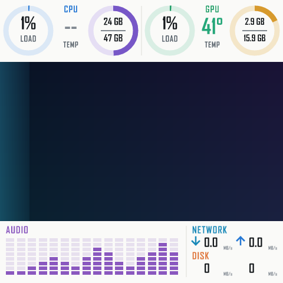

# LoopPanel


LoopPanel 是一个面向 Windows 的轻量原生 USB 屏显程序。它把本地图片、GIF 或内置动效与可编辑的 MiniJinja + SVG 模板组合，采集本机硬件信息和播放音频频谱，再把完整画面直接发送给受支持的屏幕。

当前版本只验证了一种设备配置：JONSBO TM-360 上的 480×480 MacroSilicon MS9132 屏幕。项目名称是通用的，传输层目前不是“所有 JONSBO 屏幕通用驱动”。详见[兼容性](#兼容性)与[设备迁移指南](docs/DEVICE_PORTING.md)。



LoopPanel 是独立社区项目，与 JONSBO、MacroSilicon、PawnIO 或 NVIDIA 没有隶属或官方授权关系。

## 项目来源

本项目始于替代 JONSBO TM-360 官方常驻软件的需求。实现过程在真实设备上完成了 USB 描述符核对、公开抓包比对、帧格式验证、颜色与方向测试、保活实验、资源测量和长时间动态显示测试。

显示协议以 [Fakinvisibility/b360gt-driver](https://github.com/Fakinvisibility/b360gt-driver/tree/94ae7f2a710123b582ca3fa806d85ee1c684e287) 的 B360GT Windows USBPcap 实机捕获为主要依据；启动时序、UYVY422 编码和帧分块已在本机 TM-360 上实际通过。DS339 的后续实机修正也用于排除早期错误的 BGR888 结论：[UYVY 修正](https://github.com/emaspa/InfoPanel-linux/commit/21fe373f8de962491169d0d611fb297321df60ec)、[初始化节拍修正](https://github.com/emaspa/InfoPanel-linux/commit/94415ac46260cf5f1b0d4e670b9a48e4ad38105b)。

仓库采用 MIT License。第三方组件和 PawnIO IntelMSR 模块的许可见 [THIRD-PARTY-NOTICES.md](THIRD-PARTY-NOTICES.md) 与 [THIRD-PARTY-LICENSES.txt](THIRD-PARTY-LICENSES.txt)。

## 主要能力

- 双击一个 `LoopPanel.exe` 即可启动屏显和原生 Win32 托盘；
- 首次缺少 CPU 温度服务时自动弹出一次 UAC，安装成功后后续启动不再提权；
- 托盘内启用登录时自动启动、打开配置、查看状态和安全退出；
- 三张原创 16:9 样例背景、PNG、JPEG、GIF 和无素材时的内置动效；
- 480×270 的 16:9 中央图片区，以及可自由编辑的 480×480 SVG 仪表层；
- CPU、RAM、NVIDIA GPU、显存、网络和磁盘信息；
- WASAPI 回环采集、1024 点 FFT、16 段实时音频频谱；
- 单实例屏幕锁和官方软件冲突检查。

程序没有浏览器引擎、Web 服务、账户、遥测、自动更新或 ARGB 控制代码。

## 兼容性

当前唯一受支持且经过实机验证的设备配置如下：

| 项目 | 当前配置 |
|---|---|
| 实测产品 | JONSBO TM-360 |
| USB VID/PID | `345F:9132` |
| 控制器族 | MacroSilicon MS9132 |
| 分辨率 | 480×480 |
| 显示模式 | VIC 143、UYVY422 |
| 控制接口 | HID interface 0，9 字节 Feature Report 缓冲区 |
| 视频接口 | vendor interface 3，bulk OUT endpoint `0x04` |
| 一帧大小 | 460,816 字节 |
| 分块 | `7 × 65,536 + 2,064`，帧后无 ZLP |
| Windows 驱动 | `HidUsb` + `libusb0`，通常显示为 `MS USB Display` |

仅有相同品牌、控制器或 `345F:9132` VID/PID 不足以判定兼容。同一控制器族已经发现不同分辨率、帧头高位、ZLP、触发和初始化策略。当前代码不会把其他 JONSBO 带屏水冷或其他 MS9132 OEM 屏幕误标为已支持设备。

## 使用方法

### 前置条件

1. Windows 10/11 x64；
2. TM-360 原有的签名 `MS USB Display` / `libusb0` 驱动；
3. 已安装 PawnIO 2.x；其驱动和 `PawnIOLib.dll` 不随本项目分发；
4. 从系统托盘彻底退出 `JONSBO-AIO.exe`。

### 启动

保持发布目录中的文件相对位置不变，然后双击：

```text
LoopPanel.exe
```

不需要参数、命令行或启动脚本。

首次启动时，如果系统中还没有 LoopPanel CPU 温度服务，主程序会请求一次 UAC。提升后的内部服务程序会检查 PawnIO、安装并启动最小温度服务，再把控制权交回普通权限的 LoopPanel 主程序。安装成功后的手动启动和登录自启动都不再弹出 UAC。

如果用户取消 UAC，或温度服务安装/自检失败，LoopPanel 会显示错误并停止本次启动，不会在缺少默认温度功能的状态下继续写屏。

运行后右击托盘图标可以：

- 查看屏幕和 CPU Package 温度状态；
- 打开 `looppanel.toml`；
- 启用或关闭“登录时自动启动”；
- 在连接失败后重试；
- 退出并释放 USB 接口。

## 配置

程序固定读取 `LoopPanel.exe` 旁的 `looppanel.toml`。相对的背景、模板和字体路径都以该配置文件目录为基准。

```toml
background = "samples/aurora-circuit.jpg"
template = "dashboard.svg.jinja"
font = 'C:\Windows\Fonts\AGENCYB.TTF'
title = "LoopPanel"
custom_lines = []

fps = 5
sensor_interval_ms = 1000
brightness = 0.90
show_clock = false
show_sensors = true
```

- `background`：PNG、JPEG 或 GIF；默认使用随包的 `aurora-circuit.jpg`，还可直接切换到 `liquid-alloy.jpg` 或 `orbital-glass.jpg`；省略时使用内置动效；
- `template`：MiniJinja SVG 模板；
- `font`：仅加载这一份本地 TTF/TTC 字体；
- `fps`：1–30，作为内置动效和 GIF 的帧率上限；
- `sensor_interval_ms`：最小 250 ms；默认模板按 1 Hz 更新硬件数据；
- `brightness`：0.05–1.0；
- `show_clock`、`show_sensors`：供模板判断，也控制对应采样与刷新。

背景会保持比例放进中央 480×270 区域；默认模板在上下区域绘制信息。GIF 最多 120 帧并在启动时解码，以控制常驻内存。官方 JONSBO 素材不包含在本仓库中。

修改配置或模板后，从托盘退出并重新双击 `LoopPanel.exe` 载入新内容。

## 模板语法

模板必须生成有效的 480×480 SVG。LoopPanel 使用严格未定义变量检查和 XML 自动转义；拼错字段会直接报错，而不是静默输出空内容。

```xml
<svg xmlns="http://www.w3.org/2000/svg" width="480" height="480" viewBox="0 0 480 480">
  <text x="20" y="30">{{ "%.0f"|format(cpu.load_percent) }}%</text>
  
  <text x="20" y="60">{{ "%d"|format(gpu.temperature_c) }}°C</text>
  
  <g id="audio-spectrum"/>
</svg>
```

模板可以使用条件、循环和格式化过滤器。缺失硬件值为 `none`。精确的上下文结构、字段、示例和音频频谱标记规则见[模板指南](docs/TEMPLATES.md)。默认模板只是一个可编辑示例，不是程序固定布局。

## 技术栈

- Rust 2024 edition；实测工具链 Rust 1.97.1；
- `x86_64-pc-windows-gnullvm`、`rust-lld`、`+crt-static`、Thin LTO；
- Win32、SetupAPI、HID Feature Report 与 `libusb0` bulk OUT；
- MiniJinja 2.21 + resvg/usvg/tiny-skia；
- `image` 解码 PNG、JPEG 与 GIF；
- Windows CPU Set、NT processor times、PowrProf、GlobalMemoryStatusEx；
- NVIDIA 驱动自带 NVML；
- IP Helper API、PDH；
- WASAPI loopback + 自包含 radix-2 FFT；
- PawnIO 2.x + 官方 IntelMSR 模块，用于 CPU Package 温度。

详细数据流和模块分工见[架构说明](docs/ARCHITECTURE.md)。

## 构建

项目默认目标由 `.cargo/config.toml` 设为 `x86_64-pc-windows-gnullvm`：

```powershell
cargo fmt --all -- --check
cargo test --all-targets --locked
cargo clippy --all-targets --locked -- -D warnings
cargo build --release --bins --locked
```

只生成两个程序：

- `looppanel.exe`：无控制台窗口的 GUI 主程序，发布时命名为 `LoopPanel.exe`；
- `looppanel-temperature-service.exe`：主程序在首次启动时内部调用的服务程序，不是用户启动入口。

图标的矢量源文件位于 `assets/looppanel-icon.svg`；同目录中的透明 PNG 与多尺寸 ICO 是发布用派生资源。主程序直接嵌入 ICO 作为托盘图标。

## 安全边界

- 双击主程序可能访问受支持的 USB 屏幕；测试或审阅代码时不要把启动程序当作只读检查；
- 发现 JONSBO-AIO 正在运行或已有另一个 LoopPanel 实例时拒绝写屏；
- HID、SetupAPI、`libusb0.dll` 与 `nvml.dll` 只从 Windows 系统目录加载；
- 显示路径没有固件、EEPROM、USB 描述符或未知命令写入功能；
- CPU 温度服务只接受固定采样请求，不接受任意 MSR 地址或写操作；
- 当前二进制尚未做 Authenticode 签名，公开发布前应完成代码签名和 Windows 版本资源。

## 为其他屏幕增加支持

不要通过改分辨率或复用 VID/PID 猜测兼容性。每一种新屏幕都需要描述符、官方软件启动抓包、帧结构、颜色方向、分块/触发和保活实测。完整流程、代码落点和验收清单见[设备迁移指南](docs/DEVICE_PORTING.md)。
